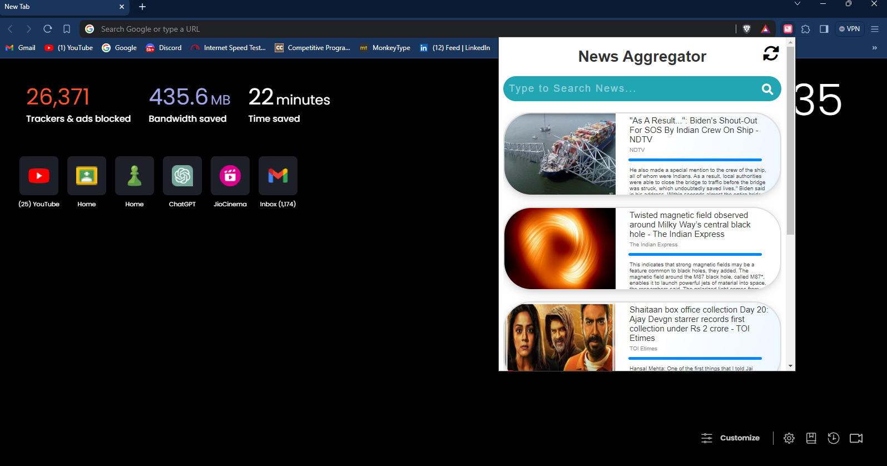

<br/>
<p align="center">
  <h3 align="center">Personalised News Aggregator</h3>
  <p align="center">
    
</p>

</p>

      

## Table Of Contents

* [About the Project](#about-the-project)
* [Built With](#built-with)
* [Getting Started](#getting-started)
  * [Prerequisites](#prerequisites)
  * [Installation](#installation)
* [Usage](#usage)
* [Contributing](#contributing)
* [License](#license)
* [Authors](#authors)


## About The Project

 <p align="center">
    
  </p>

In today's information age, staying updated with the latest news and
trends is crucial for individuals, businesses, and organizations to make informed decisions and stay ahead of the curve. However, the abundance of news sources and the sheer volume of information available can make it challenging to efficiently access relevant news content. To address this challenge, the concept of personalized news aggregation has emerged as a solution to deliver curated content tailored to the specific interests and preferences of users. A personalized news aggregator is a software application or platform that utilizes algorithms and user data to filter, organize, and present news articles and other content based on individual user profiles, behaviours, and interactions.

The system will cater to a wide range of users, including individuals seeking to stay informed about current events, businesses monitoring industry trends, researchers conducting analysis on specific topics, and media professionals tracking news developments. 

## Built With

* [HTML/CSS]()
* [JavaScript]()
* [Flask]()
* [Python]()

## Getting Started

To run this project locally you need to install modules from "requirements.txt"  and separately download the DistillBERT model from hugging face.

### Prerequisites


```sh
pip install -r requirements.txt
```


```sh
https://huggingface.co/dima806/news-category-classifier-distilbert
```

### Installation

1. Get a free API Key at [Gemini AI Studio](https://ai.google.dev/)

2. Clone the repo

```sh
git clone https://github.com/vedants03/Personalized-News-Aggregator.git
```

4. Enter your API in .env file 

```
API_KEY =ENTER YOUR API;
```

## Usage

<p align="center">
    
</p>

<p align="center">
    
</p>

The news stories on a certain subject that the user has requested are displayed in the above figures. The home page of the extension displays a variety of articles that are retrieved and scraped based on user input. When a certain article is selected, several more articles are extracted from the internet, and a combined synopsis of those articles is shown on the extension's summary page.


## Contributing

Contributions are what make the open source community such an amazing place to be learn, inspire, and create. Any contributions you make are **greatly appreciated**.
* If you have suggestions for adding or removing projects, feel free to [open an issue](https://github.com/vedants03/Personalized-News-Aggregator/issues/new) to discuss it, or directly create a pull request after you edit the *README.md* file with necessary changes.
* Please make sure you check your spelling and grammar.
* Create individual PR for each suggestion.
* Please also read through the [Code Of Conduct](https://github.com/vedants03/Personalized-News-Aggregator/blob/main/CODE_OF_CONDUCT.md) before posting your first idea as well.

### Creating A Pull Request

1. Fork the Project
2. Create your Feature Branch (`git checkout -b feature/AmazingFeature`)
3. Commit your Changes (`git commit -m 'Add some AmazingFeature'`)
4. Push to the Branch (`git push origin feature/AmazingFeature`)
5. Open a Pull Request

## License

Distributed under the MIT License. See [LICENSE](https://github.com/vedants03/Personalized-News-Aggregator/blob/main/LICENSE.md) for more information.

## Authors

* **Vedant Shahu** - *Computer Science and Engineering Student* - [Vedant Shahu](https://github.com/vedants03/)
* **Pushkar Pophali** - *Computer Science and Engineering Student* - [Pushkar Pophali](https://github.com/Pushkar-02) 
* **Pratham Vyawahare** - *Computer Science and Engineering Student* - [Pratham Vyawahare](https://github.com/Prathamvv13) 


